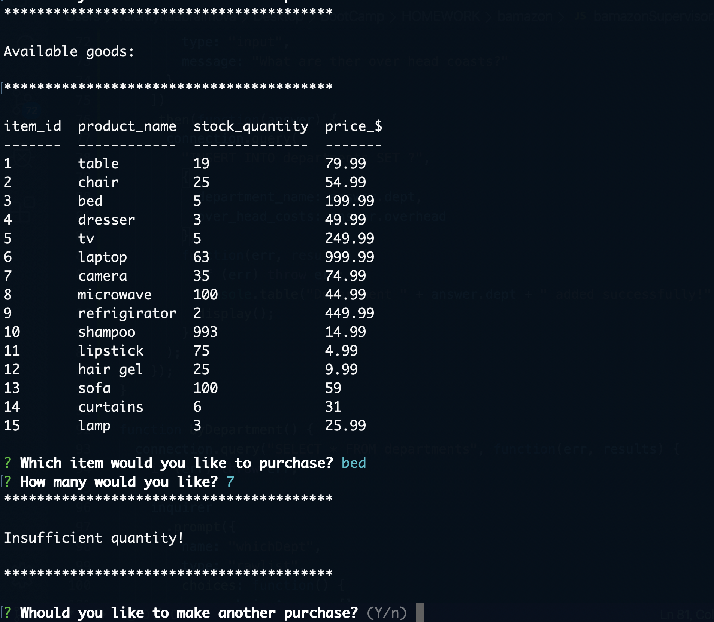

## ABOUT


Bamazon is Amazon-like storefront node application. It will take in orders from customers and deplete stock from the store's inventory. 

Consists of three applications: Customer View, Manager View and Supervisor View.

#### Customer View will allow customer to:

 - View all of the items available for sale

 - Select an item which they would like to buy

 - Get alert if there is an insufficient quantity of the product they selected

 - Purchase the product and see their total cost

#### Manager View will allow the manager to:

 - View Products for Sale

 - View Low Inventory

 - Add to Inventory

 - Add New Product

#### Supervisor View will allow the supervisor to:

 - View Product Sales by Department
 
  - Create New Department

## TECHNOLOGIES USED

- Node.js
- Inquiere package
- MySQL
- JavaScript

## INSTRUCTIONS and EXAMPLES

### ! BEFORE YOU BEGIN ! 

- In the root directory, run:
```sh
$ npm install 
```
(to install node modules)

```sh
$ npm install  mysql
```
(to install MySQL package)

```sh
$ npm install inquirer
```
(to install inquirer package)

```sh
$ npm install dotenv
```
(to install dotenv package)

- Create .env file to hold your own MySQL password
********

### TO USE _CUSTOMER VIEW_ APPILCATION:

> - Open the terminal in your root derictory. Once there, run this command:

```sh
$ node bamazonCustomer.js
```
> - You will be prompted to this screen:


> - Pick an item you would like to purchase

> - Enter the quantity

> if the store doesen't have enough of the product to meet the your request, you will get this alert:



>if the store does have enough of the product, the app will fulfill your order and show your total cost.


> - If you would like to make another purchase, press _Y_ and you will be promted to the screen _Available goods_ with an updated inventory.

> - If you would like to exit, press _N_

### TO USE _MANAGER VIEW_ APPILCATION:

> - Open the terminal in your root derictory. Once there, run this command:

```sh
$ node bamazonManager.js
```
> - You will be prompted to this screen:


> - Once there, pick what would you like to do

> if you selected _View Products For Sale_, you will see the current store inventory:


> if you selected _View Low Inventory_, you will see the list of products with low inventory:


> if you selected _Add to Inventory_, you willbe asked which product you would like to update, how much would you like to add. Then application will display back to you the updated store inventory:


> if you selected _Add New Product_, you willbe asked for the name of new product, price, department and quantity. After the update goes through, application will display back to you the updated store inventory:


> - If you would like to exit the application, please select _Exit_.

### TO USE _SUPERVISOR VIEW_ APPILCATION:

> - Open the terminal in your root derictory. Once there, run this command:

```sh
$ node bamazonSupervisor.js
```
> - You will be prompted to this screen:


> - Once there, pick what would you like to do

> if you selected _View Product Sales by Department_, you will be asked to select the department
>after the selection is made, the app will display total sales and total profit in that department:


> if you selected _Add New Department_, you willbe asked for the name of the department and the over head costs. After the update goes through, application will display back to you the updated department list:


> - If you would like to exit the application, please select _Exit_.


********
WATCH DEMONSTRATION VIDEO HERE

<a href="https://drive.google.com/file/d/1Cn_yqZSHWppXDJCHAHOeESxWovxc7eMS/view"  target="_blank">BAMAZON Demo</a>

********
Try it out and enjoy


