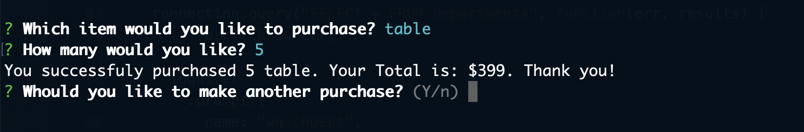
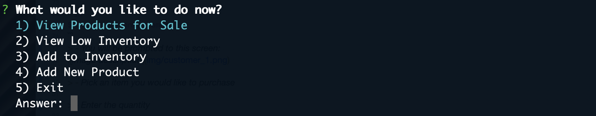
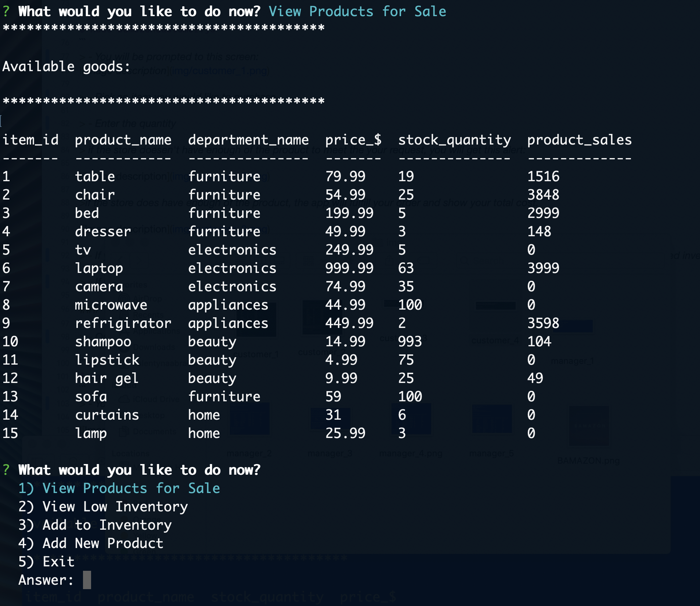
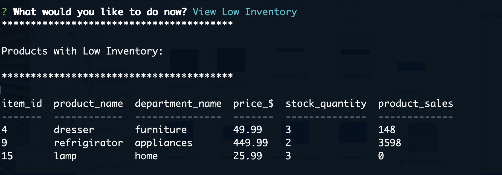

## ABOUT

### Meet BAMAZON

Bamazon is Amazon-like storefront node application. It will take in orders from customers and deplete stock from the store's inventory. 

Consists of two applications: Customer View and Manager View.

#### Customer View will:

* Display all of the items available for sale

* Ask customer which item they would like to buy

* Ask how many units of the product they would like to buy

Once the customer has placed the order, application will check if the store has enough of the product to meet the customer's request.

* If not, the app will alert the customer of insufficient quantity

* If the store does have enough of the product, the app will fulfill the customer's order. By updating the SQL database to reflect the remaining quantity and showing the customer the total cost of their purchase.

#### Manager View will allow the manager to:

* View Products for Sale

* View Low Inventory

* Add to Inventory

* Add New Product

## TECHNOLOGIES USED

- Node.js
- Inquiere package
- MySQL
- JavaScript

## INSTRUCTIONS and EXAMPLES

### ! BEFORE YOU BEGIN ! 

- In the root directory, run:
```sh
$ npm install 
```
(to install node modules)

```sh
$ npm install  mysql
```
(to install MySQL package)

```sh
$ npm install inquirer
```
(to install inquirer package)

```sh
$ npm install dotenv
```
(to install dotenv package)

- Create .env file to hold your own MySQL password
********

### TO USE _CUSTOMER VIEW_ APPILCATION:

* Open the terminal in your root derictory. Once there, run this command:

```sh
$ node bamazonCustomer.js
```
You will be prompted to this screen:


* Pick an item you would like to purchase

* Enter the quantity

> if the store doesen't have enough of the product to meet the your request, you will get this alert:


>if the store does have enough of the product, the app will fulfill your order and show your total cost.



* If you would like to make another purchase, press _N_ and you will be promted to the screen _Available goods_ with an updated inventory.

*If you would like to exit, press _N_

### TO USE _MANAGER VIEW_ APPILCATION:

* Open the terminal in your root derictory. Once there, run this command:

```sh
$ node bamazonManager.js
```
You will be prompted to this screen:



*Once there, pick what would you like to do

> if you chose to _View Inventory_, you will see the current store inventory:




> if you chose to _View Low Inventory_, you will see the list of products with low inventory:




> if you chose to _Add to Inventory_, you willbe asked which product you would like to update, how much would you like to add. Then application will display back to you the updated store inventory:


> if you chose to _Add New Product_, you willbe asked for the name of new product, price, department and quantity. After the update goes through, application will display back to you the updated store inventory:


* If you would like to exit the application, please select _Exit_.

********
WATCH DEMONSTRATION VIDEO HERE

<a href="" target="blank">BAMAZON Demo</a>

********
Try it out and enjoy


